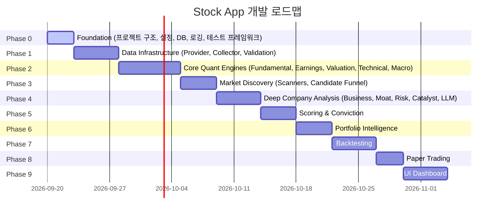
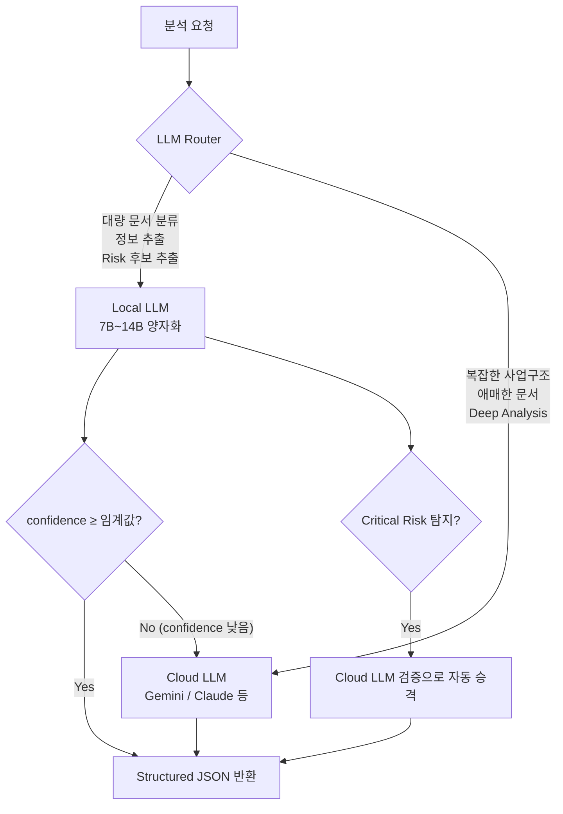
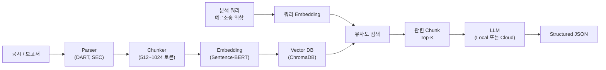

# Stock App — 통합 투자 의사결정 시스템 구현 계획

## 프로젝트 개요

마스터 플랜 v0.1에 기반하여, 한국/미국 시장을 대상으로 기업 펀더멘털·거시경제·가격데이터·포트폴리오를 통합 분석하고, 투자 후보 발굴부터 포트폴리오 리밸런싱까지 자동 지원하는 시스템을 구축합니다.

> [!IMPORTANT]
> 이 프로젝트는 **9개 Phase**로 구성되어 있으며, 이 구현 계획은 **Phase 0 (Foundation)**에 집중합니다. 각 Phase 완료 후 다음 Phase의 상세 계획을 별도로 수립합니다.

## 기존 코드 분석

기존 [quant_agent](file:///c:/Users/skymj/Desktop/학교/python/quant_agent) 프로젝트를 분석한 결과:

| 항목 | 기존 (`quant_agent`) | 신규 (`stock_app`) |
|------|----------------------|---------------------|
| 아키텍처 | 단일 레이어, API 직접 호출 | 5단계 데이터 계층 (RAW→NORMALIZED→FEATURE→SCORE→DECISION) |
| 데이터 분리 | 없음 (매번 API 호출) | Provider Adapter → Collector → Raw DB → Normalized DB |
| 검증 | 없음 | Data Validation Engine 필수 |
| 재현성 | 없음 | 모든 판단 Audit 가능 |
| 설정 관리 | 하드코딩 | YAML/JSON Configuration |
| 테스트 | 부분적 | 모든 엔진 Unit Test 필수 |
| LLM 역할 | 점수 생성에 관여 | 조사+해석+설명만 담당, 판단은 코드가 결정 |

**결론: 기존 코드를 마이그레이션하지 않고 새로 설계합니다.** 기존 기술지표 계산 로직 등은 참고하되, 아키텍처가 근본적으로 다릅니다.

---

## 전체 Phase 로드맵



---

## Phase 0 — Foundation 상세 계획

### 목표

```
프로젝트 뼈대를 완성하고, 이후 모든 Phase에서 사용할 공통 인프라를 구축한다.
UI 작업 금지.
```

---

### 프로젝트 구조

#### [NEW] `stock_app/` 전체 디렉터리 트리

```text
c:\Users\skymj\Desktop\학교\python\stock_app\

├── config/
│   ├── __init__.py
│   ├── settings.py              # 전역 설정 로더
│   ├── default_config.yaml      # 기본 설정값
│   └── scoring_weights.yaml     # 점수 가중치/임계값 (하드코딩 금지 원칙)
│
├── models/
│   ├── __init__.py
│   ├── enums.py                 # MarketType, SlotType, ConvictionClass 등 열거형
│   ├── market_data.py           # OHLCV, MarketSnapshot 데이터 모델
│   ├── financial_data.py        # IncomeStatement, BalanceSheet, CashFlow
│   ├── score_models.py          # FundamentalScore, TechnicalScore 등
│   ├── portfolio_models.py      # Slot, Holding, Portfolio
│   ├── decision_models.py       # ConvictionResult, RebalanceAction
│   ├── validation_models.py     # DataQualityResult
│   └── audit_models.py          # AuditRecord, DecisionLog
│
├── database/
│   ├── __init__.py
│   ├── connection.py            # SQLite 연결 관리
│   ├── schema.py                # 테이블 DDL 정의
│   ├── migrations.py            # 스키마 마이그레이션
│   ├── raw_store.py             # Raw 데이터 저장소
│   ├── normalized_store.py      # 정규화 데이터 저장소
│   └── audit_store.py           # 감사 로그 저장소
│
├── providers/                   # Phase 1에서 구현
│   └── __init__.py
│
├── collectors/                  # Phase 1에서 구현
│   └── __init__.py
│
├── validation/                  # Phase 1에서 구현
│   └── __init__.py
│
├── scanner/                     # Phase 3에서 구현
│   └── __init__.py
│
├── engines/                     # Phase 2~4에서 구현
│   └── __init__.py
│
├── scoring/                     # Phase 5에서 구현
│   └── __init__.py
│
├── conviction/                  # Phase 5에서 구현
│   └── __init__.py
│
├── portfolio/                   # Phase 6에서 구현
│   └── __init__.py
│
├── backtest/                    # Phase 7에서 구현
│   └── __init__.py
│
├── paper/                       # Phase 8에서 구현
│   └── __init__.py
│
├── llm/                         # Phase 4에서 구현 (인터페이스는 Phase 0에서 정의)
│   ├── __init__.py
│   ├── base.py                  # LLMProvider 추상 인터페이스
│   ├── router.py                # LLM Router (Local/Cloud 분배 + Fallback)
│   ├── local_provider.py        # 로컬 LLM Provider (7B~14B 양자화 모델)
│   ├── gemini_provider.py       # Google Gemini Provider
│   ├── prompts/                 # 구조화 프롬프트 템플릿
│   │   ├── risk_extraction.py
│   │   ├── catalyst_extraction.py
│   │   ├── business_analysis.py
│   │   └── moat_analysis.py
│   ├── schemas/                 # LLM 반환값 JSON Schema 정의
│   │   ├── risk_schema.py
│   │   ├── catalyst_schema.py
│   │   └── business_schema.py
│   ├── cache/                   # LLM 응답 캐시 (동일 공시 반복 분석 방지)
│   │   └── llm_cache.py
│   └── rag/                     # 문서 검색 증강 생성 파이프라인
│       ├── parser.py            # 공시/보고서 파서 (DART, 10-K 등)
│       ├── chunker.py           # 문서 chunk 분할
│       ├── embedder.py          # Embedding 생성
│       └── retriever.py         # 관련 chunk 검색
│
├── common/
│   ├── __init__.py
│   ├── logger.py                # 구조화 로깅 시스템
│   ├── exceptions.py            # 커스텀 예외 클래스
│   ├── constants.py             # 전역 상수
│   └── utils.py                 # 공통 유틸리티
│
├── plans/                       # 엔진별 구현 계획 문서
│   └── 00_data_model.md
│
├── tests/
│   ├── __init__.py
│   ├── conftest.py              # pytest fixtures
│   ├── test_config.py
│   ├── test_models.py
│   ├── test_database.py
│   └── test_logger.py
│
├── requirements.txt
├── pyproject.toml
├── .env.example                 # 환경변수 템플릿
└── README.md
```

---

### LLM 아키텍처 설계 원칙

> [!IMPORTANT]
> **핵심 원칙: LLM이 꺼져도 앱은 돌아가야 한다.**
> 정량 영역은 Python/DB/규칙엔진만으로 완전히 동작한다. LLM은 비정형 문서 분석의 보조 계층이다.

#### 정량 vs 비정형 영역 분리

| 영역 | 처리 방식 | LLM 필요 여부 |
|------|-----------|---------------|
| 재무분석 / 실적분석 / 밸류에이션 | Python + DB + 규칙엔진 | ❌ 불필요 |
| 차트분석 / 매크로 | Python + DB + 규칙엔진 | ❌ 불필요 |
| 스캐너 / 점수 / Conviction | Python + DB + 규칙엔진 | ❌ 불필요 |
| Portfolio Fit / Rebalancing | Python + DB + 규칙엔진 | ❌ 불필요 |
| 10-K / 10-Q / DART 사업보고서 | LLM + RAG | ✅ 사용 |
| Risk Factors / 소송 / 규제 | LLM + RAG | ✅ 사용 |
| 경영진 설명 / 신규사업 | LLM + RAG | ✅ 사용 |
| Catalyst / Moat 심층분석 | LLM + RAG | ✅ 사용 |

#### 2계층 LLM Router 구조



**호출 흐름 예시 (50개 후보 종목):**

```text
50개 후보 종목
      ↓
Local LLM (1차 분석)
→ 문서 분류, 정보 추출
→ Risk / Moat / Catalyst 후보 추출
      ↓
의심스러운 10개만 선별
      ↓
Gemini 심층 분석 (2차)
→ 복잡한 사업구조, 최종 판단 보조
```

이 구조의 장점:
- API 비용을 **약 80% 절감** (50개 전부 → 10개만 Cloud 호출)
- API 장애 시에도 1차 분석은 계속 동작
- 개인정보/데이터 외부 전송 최소화
- 동일 공시 반복 분석 방지 (캐시)

#### Fallback 정책

```python
# LLM Router 핵심 로직 (pseudo-code)
def analyze(document, task_type):
    # 1차: 로컬 LLM
    result = local_provider.analyze(document, task_type)
    
    # confidence가 낮으면 Cloud로 승격
    if result.confidence < config.llm.escalation_threshold:
        result = cloud_provider.analyze(document, task_type)
    
    # Critical Risk 탐지 시 Cloud로 검증
    if result.has_critical_risk:
        verification = cloud_provider.verify_risk(document, result)
        result = merge_results(result, verification)
    
    # 두 Provider 모두 실패해도 정량 시스템은 계속 동작
    return result
```

#### Provider 추상 인터페이스

```python
class LLMProvider(ABC):
    """모든 LLM Provider가 구현해야 하는 인터페이스"""
    
    @abstractmethod
    def analyze(self, prompt: str, context: list[str],
                schema: dict) -> LLMResult:
        """구조화 분석 수행. 반드시 schema에 맞는 JSON 반환"""
        ...
    
    @abstractmethod
    def extract(self, document: str, extraction_type: str) -> list[dict]:
        """문서에서 특정 유형의 정보 추출"""
        ...
    
    @abstractmethod
    def classify(self, text: str, categories: list[str]) -> str:
        """텍스트를 주어진 카테고리 중 하나로 분류"""
        ...
```

`LocalLLMProvider`와 `GeminiProvider`가 동일한 인터페이스를 구현하므로, 설정만 변경하면 전환 가능:

```yaml
# config/default_config.yaml
llm:
  primary: local        # 또는 gemini
  fallback: gemini      # primary 실패/confidence 낮을 때
  escalation_threshold: 0.6
  
  local:
    model: "Qwen2.5-14B-Instruct-Q4_K_M"  # 예시
    max_tokens: 4096
    temperature: 0.1
  
  gemini:
    model: "gemini-2.5-flash"
    max_tokens: 8192
    temperature: 0.2
```

#### RAG (검색 증강 생성) 파이프라인

기업 보고서(10-K, DART 사업보고서)를 통째로 LLM에 넣지 않는다.



**RAG가 특히 효과적인 분석 유형:**

| 분석 유형 | 검색 쿼리 예시 |
|-----------|----------------|
| Risk 분석 | "소송", "규제", "고객 집중", "유상증자", "원재료 위험" |
| Catalyst 분석 | "신제품", "신규 공장", "계약 체결", "인수합병" |
| Moat 분석 | "시장점유율", "특허", "기술 우위", "고객 전환비용" |
| Business 분석 | "매출 구성", "지역별 실적", "비용구조", "경쟁사" |

이 구조로 작은 로컬 LLM도 훨씬 정확한 결과를 낼 수 있다.

#### 하드웨어 고려 (RTX 3070 + 32GB RAM)

| 모델 크기 | VRAM 사용 | 적합한 작업 |
|-----------|-----------|-------------|
| 7B Q4 | ~4GB | 문서 분류, 간단한 정보 추출 |
| 7B Q8 | ~8GB | Risk/Catalyst 후보 추출 |
| 14B Q4 | ~8GB | 구조화 분석, JSON 추출 |
| Embedding (all-MiniLM) | ~0.5GB | RAG 임베딩 |

> [!TIP]
> Phase 0에서는 `LLMProvider` 인터페이스만 정의합니다. 실제 로컬/클라우드 Provider 구현은 Phase 4에서 진행합니다. 다만 인터페이스를 미리 정의해두면 다른 엔진들이 LLM 결과를 optional로 받는 구조를 처음부터 설계할 수 있습니다.

#### LLM에게 절대 시키지 않는 것

```text
❌ "이 종목을 사야 하는가?"
❌ "종합 점수를 매겨라"
❌ "매수/매도를 결정하라"
❌ "목표 비중을 정해라"
```

#### LLM에게 시키는 것

```text
⭕ "이 문서에서 공급망 위험 관련 문장을 추출하라"
⭕ "다음 공시에서 CB/BW/유상증자 관련 내용을 찾아라"
⭕ "이 사업보고서에서 신규사업 부분을 요약하라"
⭕ "경영진 전망 문장을 긍정/중립/부정으로 분류하라"
```

LLM은 **정보 추출자이자 문서 분류자**이지, **투자 결정자가 아니다.**

---

### 컴포넌트별 상세 설계

---

#### 1. Configuration 시스템

##### [NEW] [settings.py](file:///c:/Users/skymj/Desktop/학교/python/stock_app/config/settings.py)

- YAML 파일에서 설정을 로드하는 `Settings` 클래스
- `.env` 파일에서 API 키 등 민감 정보 로드
- 설정값의 타입 검증
- 싱글톤 패턴으로 전역 접근

```python
# 핵심 구조 예시
class Settings:
    def __init__(self, config_path: str = "config/default_config.yaml"):
        self._config = self._load_yaml(config_path)
        self._load_env()

    def get(self, key_path: str, default=None):
        """점 표기법으로 중첩 설정값 접근. 예: 'scoring.fundamental.weight'"""
        ...
```

##### [NEW] [default_config.yaml](file:///c:/Users/skymj/Desktop/학교/python/stock_app/config/default_config.yaml)

주요 설정 섹션:
- `database`: DB 경로, 백업 주기
- `providers`: API endpoint, timeout, retry
- `scanner`: 각 스캐너 임계값
- `portfolio`: 슬롯 구성, 최대 비중
- `logging`: 로그 레벨, 파일 경로
- `llm`: 2계층 Router 설정 (아래 상세)

**LLM 설정 상세 구조:**

```yaml
llm:
  # Router 설정
  primary: local              # 1차 분석: 로컬 LLM
  fallback: gemini            # 2차/검증: 클라우드 LLM
  escalation_threshold: 0.6   # confidence 이 값 미만이면 Cloud로 승격
  cache_ttl_hours: 168        # 동일 공시 캐시 유효기간 (7일)
  
  # 로컬 LLM 설정
  local:
    enabled: true
    backend: ollama           # ollama / llama-cpp / vllm
    model: "Qwen2.5-14B-Instruct-Q4_K_M"
    base_url: "http://localhost:11434"
    max_tokens: 4096
    temperature: 0.1
    timeout: 120
  
  # 클라우드 LLM 설정
  gemini:
    enabled: true
    model: "gemini-2.5-flash"
    max_tokens: 8192
    temperature: 0.2
    timeout: 60
    max_daily_calls: 500      # 일일 호출 제한 (비용 관리)
  
  # RAG 설정
  rag:
    chunk_size: 768
    chunk_overlap: 128
    top_k: 10
    embedding_model: "sentence-transformers/all-MiniLM-L6-v2"
    vector_db_path: "data/vector_db"
```

##### [NEW] [scoring_weights.yaml](file:///c:/Users/skymj/Desktop/학교/python/stock_app/config/scoring_weights.yaml)

마스터 플랜 §14 원칙에 따라 **모든 가중치와 임계값을 코드 밖에서 관리**:

```yaml
opportunity:
  fundamental_weight: 0.20
  earnings_weight: 0.15
  valuation_weight: 0.15
  technical_weight: 0.15
  business_weight: 0.10
  moat_weight: 0.10
  macro_fit_weight: 0.15

conviction:
  hard_gate:
    min_data_quality: 60
    max_critical_risk: 0
  classification:
    core:
      min_opportunity: 75
      max_risk: 30
    growth:
      min_opportunity: 80
      max_risk: 50
    challenge:
      min_opportunity: 85
      max_risk: 75

position_sizing:
  max_weight:
    core: 0.12
    growth: 0.08
    challenge: 0.04
```

---

#### 2. 데이터 모델 (Pydantic)

##### [NEW] [enums.py](file:///c:/Users/skymj/Desktop/학교/python/stock_app/models/enums.py)

```python
class MarketType(str, Enum):
    US = "US"
    KR = "KR"

class SlotType(str, Enum):
    CORE = "CORE"
    GROWTH = "GROWTH"
    CHALLENGE = "CHALLENGE"
    BOND = "BOND"
    GOLD = "GOLD"
    COMMODITY = "COMMODITY"
    FX = "FX"
    DEVELOPED_MARKET = "DEVELOPED_MARKET"
    GLOBAL_OPPORTUNITY = "GLOBAL_OPPORTUNITY"

class ConvictionClass(str, Enum):
    CORE = "CORE"
    GROWTH = "GROWTH"
    CHALLENGE = "CHALLENGE"
    WATCH = "WATCH"
    REJECT = "REJECT"

class DataLayer(str, Enum):
    RAW = "RAW"
    NORMALIZED = "NORMALIZED"
    FEATURE = "FEATURE"
    SCORE = "SCORE"
    DECISION = "DECISION"

class MarketRegime(str, Enum):
    STRONG_UPTREND = "STRONG_UPTREND"
    UPTREND = "UPTREND"
    SIDEWAYS = "SIDEWAYS"
    EARLY_REVERSAL = "EARLY_REVERSAL"
    OVERHEATED = "OVERHEATED"
    DOWNTREND = "DOWNTREND"
    PANIC_OVERSOLD = "PANIC_OVERSOLD"
    RECOVERY = "RECOVERY"

class MacroRegime(str, Enum):
    GROWTH_UP_INFLATION_DOWN = "GROWTH_UP_INFLATION_DOWN"
    GROWTH_DOWN_INFLATION_DOWN = "GROWTH_DOWN_INFLATION_DOWN"
    GROWTH_UP_INFLATION_UP = "GROWTH_UP_INFLATION_UP"
    GROWTH_DOWN_INFLATION_UP = "GROWTH_DOWN_INFLATION_UP"

class RebalanceAction(str, Enum):
    HOLD = "HOLD"
    INCREASE = "INCREASE"
    REDUCE = "REDUCE"
    PARTIAL_EXIT = "PARTIAL_EXIT"
    REPLACE = "REPLACE"
    FULL_EXIT = "FULL_EXIT"
```

##### [NEW] [market_data.py](file:///c:/Users/skymj/Desktop/학교/python/stock_app/models/market_data.py)

Pydantic 모델:
- `OHLCV`: 일봉 데이터 (date, open, high, low, close, adj_close, volume)
- `MarketSnapshot`: 특정 시점의 시장 상태
- `TickerInfo`: 종목 메타정보 (ticker, name, market, sector, market_cap)

##### [NEW] [financial_data.py](file:///c:/Users/skymj/Desktop/학교/python/stock_app/models/financial_data.py)

- `IncomeStatement`: 매출, 영업이익, 순이익, EPS 등
- `BalanceSheet`: 자산, 부채, 자본, 순부채
- `CashFlow`: 영업CF, 투자CF, 재무CF, FCF
- `FinancialPeriod`: 분기/연간 구분 + 기간

##### [NEW] [score_models.py](file:///c:/Users/skymj/Desktop/학교/python/stock_app/models/score_models.py)

모든 점수 모델은 0~100 범위, 계산 시점, 입력 데이터 버전을 포함:

```python
class BaseScore(BaseModel):
    score: float = Field(ge=0, le=100)
    computed_at: datetime
    data_version: str
    subscores: dict[str, float] = {}
```

하위 모델: `FundamentalScore`, `EarningsScore`, `ValuationScore`, `TechnicalScore`, `MacroFitScore`, `BusinessScore`, `MoatScore`, `RiskScore`, `CatalystScore`, `OpportunityScore`

##### [NEW] [portfolio_models.py](file:///c:/Users/skymj/Desktop/학교/python/stock_app/models/portfolio_models.py)

- `Slot`: 슬롯 유형, 현재 보유 종목, 목표 비중, 실제 비중
- `Holding`: ticker, 수량, 평균가, 현재가, 수익률
- `Portfolio`: 전체 슬롯 목록, 총 자산, 현금 비중

##### [NEW] [audit_models.py](file:///c:/Users/skymj/Desktop/학교/python/stock_app/models/audit_models.py)

마스터 플랜 §1.5 원칙 준수:

```python
class AuditRecord(BaseModel):
    timestamp: datetime
    ticker: str
    decision: str
    input_data_version: str
    data_source: str
    analysis_date: date
    engine_scores: dict[str, float]
    applied_weights: dict[str, float]
    risk_flags: list[str]
    llm_analysis: Optional[str]
    portfolio_state: dict
    final_conviction: float
    target_weight: float
    reasoning: str
```

---

#### 3. 데이터베이스

##### [NEW] [connection.py](file:///c:/Users/skymj/Desktop/학교/python/stock_app/database/connection.py)

- SQLite 사용 (로컬 단일 사용자 앱에 적합)
- WAL 모드 활성화 (동시 읽기 성능)
- 커넥션 풀 관리
- 자동 백업 기능

##### [NEW] [schema.py](file:///c:/Users/skymj/Desktop/학교/python/stock_app/database/schema.py)

주요 테이블:

```sql
-- Raw 데이터 (수정 금지 원칙)
raw_market_data     (id, ticker, date, source, data_json, collected_at)
raw_financial_data  (id, ticker, period, source, data_json, collected_at)
raw_macro_data      (id, indicator, date, source, value, collected_at)

-- 정규화 데이터
normalized_ohlcv    (ticker, date, open, high, low, close, adj_close, volume, source)
normalized_financials (ticker, period_type, period_end, metric, value, source)

-- 점수 히스토리 (Score Momentum 계산용)
score_history       (ticker, date, engine, score, subscores_json)

-- 감사 로그
audit_log           (id, timestamp, ticker, decision_json, reasoning)

-- 데이터 품질
data_quality_log    (ticker, date, quality_score, missing_ratio, conflict_flags_json, ...)

-- 문서 / RAG 관련
documents           (id, ticker, doc_type, source, filing_date, raw_text, collected_at)
document_chunks     (id, document_id, chunk_index, chunk_text, embedding_id)

-- LLM 캐시 (동일 공시 반복 분석 방지)
llm_cache           (id, document_id, task_type, provider, result_json,
                     confidence, created_at, expires_at)
```

##### [NEW] [migrations.py](file:///c:/Users/skymj/Desktop/학교/python/stock_app/database/migrations.py)

- 버전 기반 스키마 마이그레이션
- 롤백 지원

---

#### 4. 로깅 시스템

##### [NEW] [logger.py](file:///c:/Users/skymj/Desktop/학교/python/stock_app/common/logger.py)

마스터 플랜 §29 준수:

```python
def get_engine_logger(engine_name: str) -> Logger:
    """엔진별 구조화 로거 생성"""
    # 필수 필드: timestamp, engine, ticker, input_version,
    #           output, warning, error, execution_time
```

- JSON 구조화 로깅 (파일)
- 콘솔 출력 (사람이 읽기 쉬운 형태)
- 로그 레벨별 분리 (DEBUG, INFO, WARNING, ERROR)
- 실행시간 자동 측정 데코레이터

---

#### 5. 예외 처리

##### [NEW] [exceptions.py](file:///c:/Users/skymj/Desktop/학교/python/stock_app/common/exceptions.py)

```python
class StockAppError(Exception): ...
class DataValidationError(StockAppError): ...
class DataCollectionError(StockAppError): ...
class ScoreCalculationError(StockAppError): ...
class InsufficientDataError(StockAppError): ...
class ProviderError(StockAppError): ...
class LLMError(StockAppError): ...
class ConfigurationError(StockAppError): ...
class AuditError(StockAppError): ...
```

> [!TIP]
> 마스터 플랜 §35.11: API 실패가 전체 앱 중단으로 이어지지 않도록, 모든 외부 호출은 try-except로 감싸고 `ProviderError`로 변환합니다.

---

#### 6. 테스트 프레임워크

##### [NEW] [conftest.py](file:///c:/Users/skymj/Desktop/학교/python/stock_app/tests/conftest.py)

- `tmp_db`: 임시 SQLite DB fixture
- `sample_ohlcv`: 테스트용 가격 데이터 fixture
- `sample_financials`: 테스트용 재무 데이터 fixture
- `mock_settings`: 테스트용 설정 fixture

마스터 플랜 §33에서 요구하는 **에지 케이스** fixture:

```python
@pytest.fixture
def missing_data_ohlcv(): ...      # 결측값이 있는 가격 데이터
@pytest.fixture
def stock_split_ohlcv(): ...       # 액면분할이 포함된 가격 데이터
@pytest.fixture
def zero_revenue_financials(): ... # 매출 0인 재무 데이터
@pytest.fixture
def negative_equity(): ...         # 자본잠식 재무 데이터
```

---

### 의존성

##### [NEW] [requirements.txt](file:///c:/Users/skymj/Desktop/학교/python/stock_app/requirements.txt)

```text
# 핵심
pydantic>=2.0
pyyaml>=6.0
python-dotenv>=1.0

# 데이터 처리
pandas>=2.0
numpy>=1.24

# 기술적 분석 (Phase 2)
ta>=0.11

# 데이터 수집 (Phase 1)
yfinance>=0.2
requests>=2.31

# LLM - Cloud (Phase 4)
google-genai>=1.0

# LLM - Local (Phase 4, 선택적)
# ollama 패키지 (Python 클라이언트)
# ollama>=0.3

# RAG - Embedding & Vector DB (Phase 4)
# sentence-transformers>=3.0
# chromadb>=0.5

# 테스트
pytest>=8.0
pytest-cov>=4.0

# 로깅
structlog>=24.0
```

> [!NOTE]
> 로컬 LLM(`ollama`)과 RAG(`sentence-transformers`, `chromadb`) 의존성은 Phase 4에서 실제 구현할 때 활성화합니다. Phase 0에서는 인터페이스만 정의하므로 주석 처리합니다.

---

## User Review Required

> [!IMPORTANT]
> **새 프로젝트 디렉터리**: `stock_app`을 `c:\Users\skymj\Desktop\학교\python\stock_app\` 에 생성합니다. 기존 `quant_agent`는 수정하지 않습니다. 이 방향이 맞습니까?

> [!IMPORTANT]
> **데이터베이스 선택**: 로컬 개인용 앱이므로 **SQLite**를 사용합니다. 추후 확장이 필요하면 PostgreSQL로 마이그레이션할 수 있도록 추상화합니다.

> [!IMPORTANT]
> **Python 버전**: 현재 시스템에 Python 3.12.10이 설치되어 있습니다. 3.12 기능(improved error messages, `type` 문 등)을 적극 활용합니다.

## Open Questions

> [!IMPORTANT]
> **1. API 키 관리**: DART, SEC EDGAR, FRED, ECOS 등의 API 키를 이미 보유하고 계신가요? Phase 1에서 어떤 데이터 소스부터 연동할지 우선순위를 정해야 합니다.

> [!IMPORTANT]
> **2. 로컬 LLM 백엔드**: 로컬 LLM 실행 환경으로 **Ollama**를 기본 백엔드로 설정하려 합니다. 이미 Ollama를 설치하셨거나, 다른 백엔드(llama.cpp, vLLM 등)를 선호하시나요? (Phase 4에서 본격 구현하므로 지금 당장은 필요 없습니다)

> [!IMPORTANT]
> **3. 가상환경**: `stock_app` 프로젝트에 별도 `.venv`를 생성할까요, 아니면 기존 환경을 공유할까요?

## Verification Plan

### Phase 0 완료 기준

1. **설정 시스템**: YAML 설정 로드 및 점 표기법 접근 테스트 통과
2. **데이터 모델**: 모든 Pydantic 모델 직렬화/역직렬화 테스트 통과
3. **데이터베이스**: 스키마 생성, CRUD 기본 동작, 마이그레이션 테스트 통과
4. **로깅**: 구조화 로그 출력 및 파일 저장 테스트 통과
5. **예외 처리**: 예외 계층 구조 및 에러 전파 테스트 통과

### Automated Tests

```bash
cd c:\Users\skymj\Desktop\학교\python\stock_app
python -m pytest tests/ -v --tb=short
```
